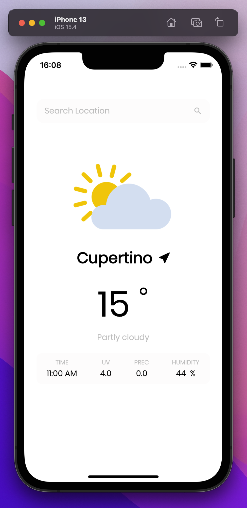

# weather_app

Flutter project

## Getting Started

This project was built with the objective of putting into practice my knowledge in Flutter and Dart

To run the project it is necessary to create an account on the site
[Weather Api](https://www.weatherapi.com), create a file called api_key.dart in the root of the project where the api key will be inserted, after that just run the app

## Screenshots

This app use location of the device to return firts weather information, please alow

### Light Theme

### Dark Theme

